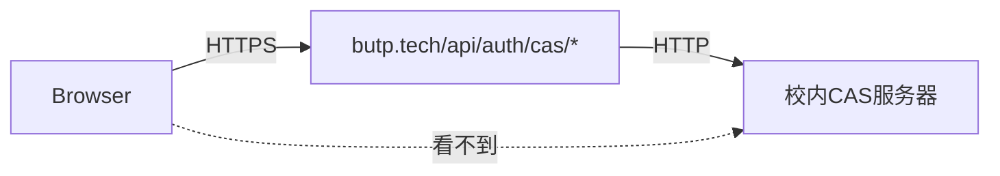
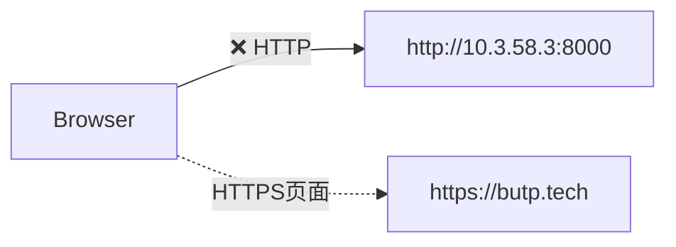
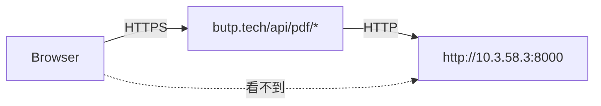

# API代理解决方案 - 与CAS认证架构保持一致

## 🎯 **您的问题分析**

### **为什么CAS认证不受Mixed Content影响？**



**CAS认证架构**：
- ✅ 浏览器 → `https://butp.tech/api/auth/cas/*` (HTTPS)
- ✅ 服务器端 → `http://校内CAS服务器` (后端代理)
- ✅ **浏览器无直接HTTP请求** → 无Mixed Content

### **之前PDF服务的问题架构**：



**直连架构问题**：
- ❌ 浏览器直接从HTTPS页面请求HTTP资源
- ❌ 触发Mixed Content安全策略
- ❌ 请求被浏览器阻止

## 🛠️ **新的API代理解决方案**

### **与CAS认证一致的架构**：



**代理架构优势**：
- ✅ 浏览器 → `https://butp.tech/api/pdf/*` (HTTPS)
- ✅ 服务器端 → `http://10.3.58.3:8000` (后端代理)
- ✅ **与CAS认证模式完全一致**
- ✅ **无Mixed Content问题**

## 📋 **实现的组件**

### **1. API代理端点**
- `/app/api/pdf/generate/route.ts` - PDF生成代理
- `/app/api/pdf/health/route.ts` - 健康检查代理

```typescript
// POST: PDF生成代理
export async function POST(request: NextRequest) {
  // 转发请求到校内服务，包含认证信息
  const campusResponse = await fetch('http://10.3.58.3:8000/generate-pdf', {
    method: 'POST',
    headers: { /* 转发认证头 */ },
    body: JSON.stringify(requestBody)
  })
}
```

### **2. 更新的前端组件**
- ✅ `AuthenticatedUrlExportButton` → 使用 `/api/pdf/generate`
- ✅ `QuickExternalTestButton` → 使用 `/api/pdf/generate`
- ✅ `CampusPdfServiceButton` → 使用 `/api/pdf/generate`
- ✅ `ProxyHealthCheck` → 使用 `/api/pdf/health` 监控状态

## 🎯 **架构对比**

| 方案 | 架构 | Mixed Content | 与CAS一致性 | 复杂度 |
|------|------|---------------|-------------|--------|
| **直连HTTP** | Browser → HTTP | ❌ 阻止 | ❌ 不一致 | 简单 |
| **直连HTTPS** | Browser → HTTPS | ✅ 允许 | ❌ 不一致 | 中等 |
| **API代理** | Browser → API → HTTP | ✅ 允许 | ✅ 一致 | 简单 |

## 🚀 **部署优势**

### **1. 简化部署**
- ❌ **不需要**在校内服务器配置HTTPS
- ❌ **不需要**SSL证书管理
- ❌ **不需要**开放8443端口
- ✅ **保持现有**HTTP服务(8000端口)

### **2. 统一架构**
- ✅ **与CAS认证模式一致**
- ✅ **统一的API路由** (`/api/*`)
- ✅ **统一的错误处理**
- ✅ **统一的认证转发**

### **3. 更好的维护性**
- 🔧 **集中式配置** - 校内服务URL在API中管理
- 🔧 **统一监控** - 代理层可以记录和监控所有请求
- 🔧 **错误处理** - API层统一处理校内服务异常

## 📊 **测试验证**

### **1. 健康检查**
```bash
# 检查代理API状态
curl https://butp.tech/api/pdf/health

# 预期响应
{
  "status": "healthy",
  "proxy": "butp-pdf-proxy", 
  "campusService": {
    "status": 200,
    "data": { "service": "campus-pdf-service" }
  }
}
```

### **2. PDF生成测试**
访问Dashboard页面，使用"代理健康检查"组件：
- ✅ 检查代理连接状态
- ✅ 验证校内服务响应
- ✅ 测试PDF生成功能

## 🎉 **总结**

这个API代理方案：

1. **解决了Mixed Content问题** - 浏览器只与HTTPS API通信
2. **与CAS认证架构一致** - 使用相同的服务器端代理模式  
3. **简化了部署复杂度** - 无需HTTPS配置
4. **提供了更好的监控** - API层统一管理和监控

这是比HTTPS直连更好的解决方案，因为它与您现有的CAS认证架构完全一致！ 🎯
