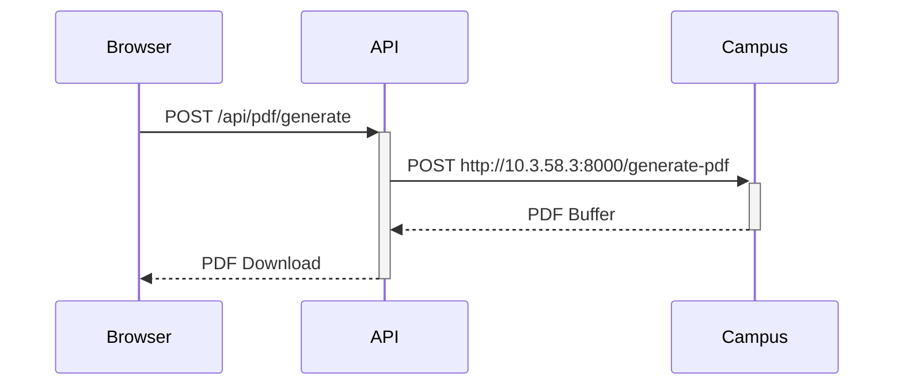
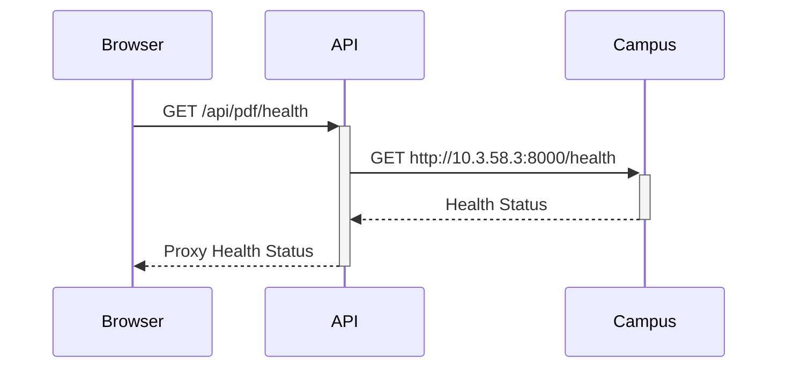

# PDF服务代理架构 - 与CAS认证保持一致

## 🎯 **API路由结构**

### **正确的路由约定** ✅
```
https://butp.tech/api/pdf/* → http://校内PDF服务器
```

### **具体端点映射**
```
/api/pdf/generate → http://10.3.58.3:8000/generate-pdf
/api/pdf/health  → http://10.3.58.3:8000/health
```

## 🏗️ **架构对比**

### **CAS认证架构（参考）**
```
Browser → https://butp.tech/api/auth/cas/* → http://校内CAS服务器
```

### **PDF服务架构（现在）**
```
Browser → https://butp.tech/api/pdf/* → http://校内PDF服务器
```

**完全一致的代理模式！** ✅

## 📁 **文件结构**

```
app/api/pdf/
├── generate/
│   └── route.ts          # PDF生成代理
└── health/
    └── route.ts          # 健康检查代理
```

## 🔄 **请求流程**

### **1. PDF生成流程**


### **2. 健康检查流程**


## 🎯 **关键优势**

### **1. 与现有架构一致**
- ✅ 使用相同的 `/api/*` 路由约定
- ✅ 相同的服务器端代理模式
- ✅ 相同的错误处理机制

### **2. 解决Mixed Content问题**
- ✅ 浏览器只与HTTPS API通信
- ✅ HTTP请求在服务器端进行
- ✅ 无需修改校内服务器配置

### **3. 统一管理**
- ✅ 集中式配置和监控
- ✅ 统一的认证信息转发
- ✅ 一致的错误响应格式

## 🚀 **部署验证**

### **本地测试**
```bash
# 启动开发服务器
npm run dev

# 访问健康检查
curl http://localhost:3000/api/pdf/health

# 测试PDF生成
# (通过Dashboard页面的"快速测试"按钮)
```

### **生产环境测试**
```bash
# 访问健康检查
curl https://butp.tech/api/pdf/health

# 测试PDF生成
# (通过Dashboard页面的"快速测试"按钮)
```

## 📊 **成功指标**

修复后应该看到：
- ✅ 无Mixed Content控制台错误
- ✅ "快速测试"按钮成功下载PDF
- ✅ "认证导出"生成真实Dashboard数据
- ✅ 代理健康检查显示正常状态

## 🔧 **故障排除**

### **如果健康检查失败**
1. 检查校内PDF服务状态
2. 检查网络连接到10.3.58.3:8000
3. 查看API路由日志

### **如果PDF生成失败**
1. 检查请求体格式
2. 检查认证信息转发
3. 查看校内服务响应
